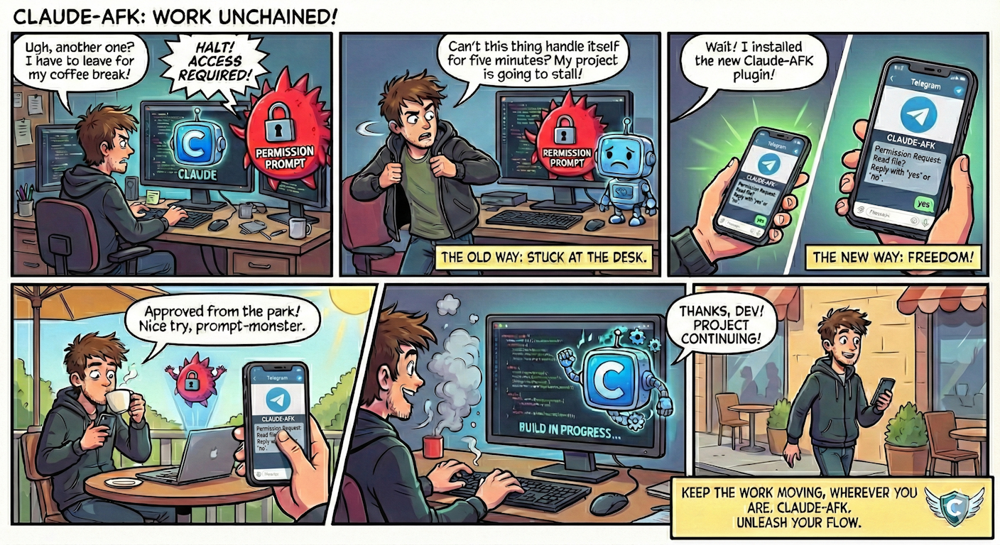

# Claude AFK

**Keep the work moving, wherever you are.**



*Unleash your flow.* Route Claude Code permission requests and task notifications to your phone via Telegram.

---

## What It Does

When you're away from your computer, Claude AFK keeps your Claude Code sessions productive:

- **Permission requests** → Telegram notification → Reply `yes`/`no` from your phone
- **Task completions** → Telegram notification → Reply with follow-up instructions
- **Multiple sessions** → Each terminal session tracked independently

**Example workflow:**
1. Start a long-running task: *"Refactor all the API endpoints to use the new auth system"*
2. Walk away from your computer
3. Receive Telegram notifications when Claude needs permission
4. Reply `yes` to approve, `no` to deny, or `all` to approve all similar requests
5. When Claude finishes, reply with next instructions or let it stop

---

## Quick Start

**Time required:** ~5 minutes

### 1. Install the Plugin

```
/plugin marketplace add marvellous-bear/claude-plugins
/plugin install claude-afk@marvellous-bear/claude-plugins
```

### 2. Create a Telegram Bot

1. Open Telegram and message **@BotFather**
2. Send `/newbot` and follow the prompts
3. Copy the bot token (looks like `123456789:ABCdefGHI...`)

### 3. Set Your Token

**Windows (PowerShell - permanent):**
```powershell
[Environment]::SetEnvironmentVariable("CLAUDE_AFK_TELEGRAM_TOKEN", "your-token", "User")
```

**macOS/Linux (permanent):**
```bash
echo 'export CLAUDE_AFK_TELEGRAM_TOKEN="your-token"' >> ~/.bashrc && source ~/.bashrc
```

### 4. Restart Claude Code

Close and reopen your terminal, then start Claude Code.

### 5. Pair with Telegram

```
/claude-afk:setup
```

When prompted, send `/start` to your Telegram bot within 60 seconds.

### 6. Enable and Test

```
/claude-afk:enable
```

Ask Claude to do something requiring permission. You should receive a Telegram notification!

---

## Commands

| Command | Description |
|---------|-------------|
| `/claude-afk:setup` | Pair with your Telegram bot (one-time setup) |
| `/claude-afk:enable` | Turn on AFK mode for this session |
| `/claude-afk:disable` | Turn off AFK mode |
| `/claude-afk:status` | Check daemon and session status |

---

## Responding to Notifications

### Permission Requests

When Claude needs permission, you'll receive a message showing:
- Project name and session ID
- What Claude was working on (context)
- The specific permission being requested

**Reply with:**
- `yes` or `y` — Approve this request
- `no` or `n` — Deny this request
- `all` — Approve this and all future requests of this type (for Edit/Write tools)

> **Important:** You must use Telegram's reply feature (swipe right on mobile, right-click → Reply on desktop).

### Task Completions

When Claude finishes a task, you'll receive a notification. Reply with:
- Follow-up instructions (e.g., *"now run the tests"*)
- Or don't reply — Claude will stop after 60 seconds

---

## How It Works

```
┌─────────────────────────────────────────────────────────────┐
│                   Claude Code Sessions                      │
│   ┌──────────┐    ┌──────────┐    ┌──────────┐              │
│   │ Session A│    │ Session B│    │ Session C│              │
│   └────┬─────┘    └────┬─────┘    └────┬─────┘              │
└────────┼───────────────┼───────────────┼────────────────────┘
         │               │               │
         │    Named Pipe IPC (NDJSON)    │
         ▼               ▼               ▼
┌─────────────────────────────────────────────────────────────┐
│                    Daemon (Singleton)                       │
│   ┌────────────────┐  ┌────────────────┐  ┌──────────────┐  │
│   │Session Registry│  │Telegram Polling│  │  IPC Server  │  │
│   └────────────────┘  └────────────────┘  └──────────────┘  │
└─────────────────────────────────────────────────────────────┘
                              │
                              ▼
                    ┌─────────────────┐
                    │  Your Phone     │
                    │   (Telegram)    │
                    └─────────────────┘
```

**Key components:**

1. **Hooks** — Intercept Claude's permission requests and task completions
2. **Daemon** — A singleton process that manages all sessions and communicates with Telegram
3. **IPC** — Named pipes for fast communication between hooks and daemon
4. **Telegram API** — Long-polling for real-time message delivery

**Design principles:**

- **Fail-open** — If the daemon is unavailable, Claude shows its normal permission prompt
- **Multi-session** — Run multiple terminals; each has independent AFK mode
- **Clean up** — If you approve locally in Claude, the Telegram notification is deleted

---

## Configuration

Create `~/.claude/claude-afk/config.json` to customize behavior:

```json
{
  "stopFollowupTimeout": 60,
  "pollingInterval": 2,
  "bulkApprovalTools": ["Edit", "Write"]
}
```

| Option | Default | Description |
|--------|---------|-------------|
| `stopFollowupTimeout` | `60` | Seconds to wait for follow-up after task completion |
| `pollingInterval` | `2` | Seconds between Telegram API polls |
| `bulkApprovalTools` | `["Edit", "Write"]` | Tools that support `all` response |
| `staleUpdateThreshold` | `300` | Ignore Telegram messages older than this (seconds) |
| `allowSinglePendingFallback` | `false` | Allow non-reply messages when only one request is pending |

---

## Troubleshooting

### "Token not configured"

Your environment variable isn't set or Claude Code can't see it.

**Fix:**
1. Verify: `echo $CLAUDE_AFK_TELEGRAM_TOKEN` (bash) or `echo $env:CLAUDE_AFK_TELEGRAM_TOKEN` (PowerShell)
2. If empty, set it again and **restart your terminal**
3. Start a new Claude Code session

### Setup times out

The bot didn't receive your `/start` message.

**Fix:**
1. Make sure you're messaging **your bot** (not @BotFather)
2. Run `/claude-afk:setup` again
3. Send `/start` immediately when prompted

### Not receiving notifications

Run `/claude-afk:status` and check:
- `Chat ID: paired` — If not paired, run `/claude-afk:setup`
- `This Session: AFK mode enabled` — If not, run `/claude-afk:enable`
- `Daemon: running` — If not, check for stale lock files

### Responses not being processed

You must **reply directly** to the notification message:
- **Mobile:** Swipe right on the message
- **Desktop:** Right-click → Reply

### "Conflict: terminated by other getUpdates request"

Another daemon instance is polling Telegram.

**Fix:**
1. Close other terminals running the daemon
2. Wait 60 seconds for the lock to expire
3. Try again

---

## Security

- **Bot token** — Stored in environment variable, never committed to git
- **Chat ID** — Stored locally in `~/.claude/claude-afk/state.json`
- **Message filtering** — Only messages from your paired chat ID are processed
- **No external servers** — Direct communication with Telegram API only

---

## Limitations

- **Telegram required** — Currently only supports Telegram (no Slack, Discord, etc.)
- **Reply required** — Must use Telegram's reply feature for message routing
- **Single user** — One Telegram chat per installation
- **Internet required** — Both your computer and phone need connectivity

---

## Requirements

- Claude Code with plugin support
- Node.js 18+
- Telegram account

---

## Further Documentation

| Document | Description |
|----------|-------------|
| [Architecture Details](./docs/ARCHITECTURE.md) | Deep dive into system design |
| [Testing Guide](./docs/TESTING.md) | How to run and write tests |
| [Contributing](./docs/CONTRIBUTING.md) | Development setup and guidelines |

---

## License

MIT — See [LICENSE](./LICENSE)
